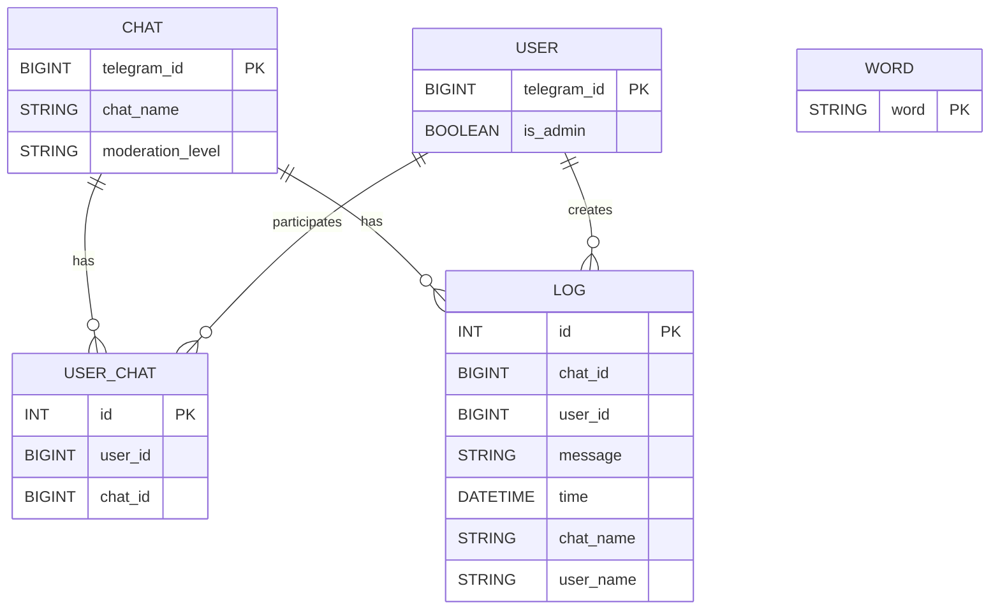

# Бот модерации чатов

_____

### Ссылка на бота

https://t.me/cu_clear_bot
___

### Инструкция для взаимодействия

___

#### Как подключить бота в чат

!!! ВАЖНО ОТКЛЮЧИ АНОНИМНОСТЬ В НАСТРОЙКАХ ВСЕХ АДМИНОВ 

Нужно добавить бота в администраторы чата и выдать ему права: Управление
сообщениями, Блокировка пользователей, Пригласительные ссылки

Подробнее скриншотами 

___

#### Как управлять чатами

---
Напиши /start боту, после этого нажми на "Добавленные чаты" - тебе покажутся,
все доступные чаты
---
Можно выгрузить все логи по чатам - кнопка "Выгрузить все логи"

---
Чтобы перейти в конкретный чат - нужно нажать на кнопку, с названием этого чата

---
Можно включить/выключить модерацию чата - нажать на кнопку Выключить/Включить
модерацию

---
Чтобы выгрузить только логи этого чата - нужно в этом же меню нажать на кнопку
"Выгрузить логи"

Формат логов:
имя чата | юзернейм пользователя | айди пользователя | сообщение | время лога

В сообщение может храниться [ServiceMessage] - юзер зашел/вышел

---

Чтобы добавить запретное слово - нажми на кнопку "Добавить слово" и после этого напиши нужное слово.

Если нужно отменить ввод слова - нажми кнопку "Отмена"

---

Для удаления слова - то же самое, ток кнопка "Удалить слово"

Если слова не было в бд - бот ответит, что этого слова и не было

____
#### Удалить бота 

Просто удали бота из чата - и в самом боте этот чат пропадет.
____
### Запуск бота локально

    docker-compose up -d

